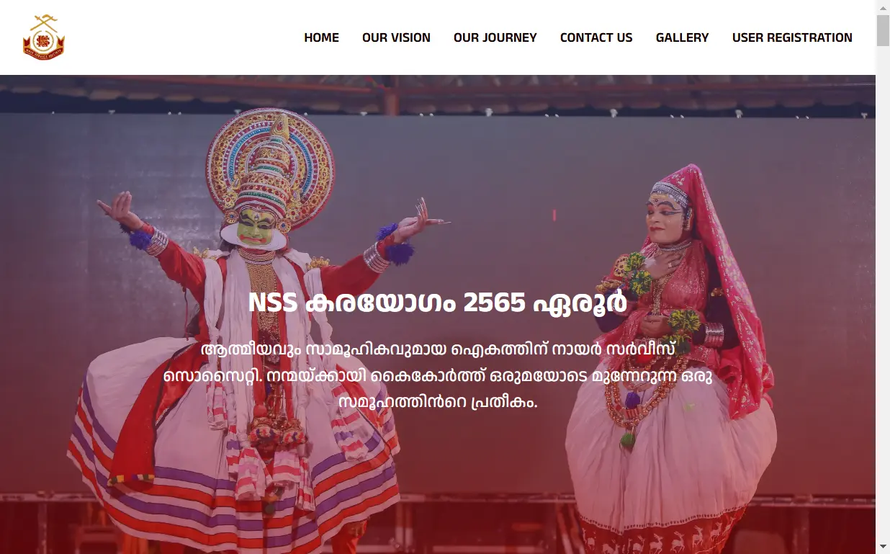

# NSS Eroor Portfolio Website

## Introduction

This website serves as the official portfolio website of Nair Service Society at Eroor Branch, a non-profit organization dedicated to preserving and promoting the rich cultural heritage, traditions, and values of the Nair community. Our goal is to provide visitors with an overview of our initiatives, impact, and ways to get involved.

## Description

This portfolio website highlights the key aspects of Nair Service Society at Eroor Branch, including its history, cultural events, social initiatives, and community programs. It serves as a digital platform to connect with members, supporters, and those interested in learning about the Nair community.

## Usage

Explore the NSS Eroor Branch portfolio, view events, and register for community initiatives: [Visit Website](https://nsseroor2565.vercel.app/)

## Website Sections

- **Navigation Section** : A responsive navigation bar for easy access to different parts of the website.
- **Hero Section** : A visually appealing introduction to the project.
- **Our Vision Section** : Describes the vision and mission of the organization.
- **Our Journey Section** : Highlights the journey of the organization from its inception to the present.
- **Contact Us Section** : A slider of cards featuring committee members with their contact details.
- **Gallery Section** : Displays images related to the organization's events and activities
- **User Registration Section** : A form for new users to register as part of the Nair community.
- **Footer Section** : Contains links and copyright information.

## Technology Stack

| Component           | Technology Used       |
| ------------------- | --------------------- |
| **Front End**       | HTML, CSS, JavaScript |
| **Back End**        | Google Apps Script    |
| **API**             | Apico                 |
| **Database**        | Google Sheets         |
| **File Storage**    | Google Drive          |
| **Deployment**      | Vercel                |
| **Version Control** | Git & GitHub          |
|                     |                       |

## Features

### **Responsive Design**

Designed to provide an optimal user experience across all devices, including desktops, tablets, and mobile phones. The interface dynamically adjusts to different screen sizes, ensuring smooth navigation, readability, and usability without compromising functionality.

### **Slider Compoment**

Sliders that displays committee members in a horizontally scrollable format. Users can navigate through profiles using left and right buttons. It dynamically fetches data from a JSON file and renders the profiles accordingly.

### **Form Validation**

Validates user inputs with regular expressions, provides clear error messages for incorrect values, and disables the submit button if errors are present.

### **Form Submission**

Once all inputs are valid, users can click the submit button to send the data to an external API endpoint, which transfers it to a Google Sheet. Upon submission, users receive an alert confirming success or notifying them of a failure, ensuring a seamless and transparent process.

### **Automatic User ID Assignment**

Automatically generates and assigns a unique user ID to each new registrant. The system retrieves the last assigned ID from stored script properties, increments it, and updates the record in the database. This ensures seamless user tracking,

### **Automatic User Folder Creation**

Each new user gets a dedicated subfolder in Google Drive, named with their unique user ID. This ensures organized storage for profile photos and documents, enabling easy retrieval and management.

### **Automated Document Submission Reminder Email**

After registration,users automatically receive an email with instructions to upload required documents. This ensures they complete the process by submitting their profile photo and No Objection Letter (if applicable).

### **Automated Status-Based Email Notifications**

When the admin updates the registration status, the system automatically sends an email to the user. Approved users receive payment instructions, while rejected users are notified with further guidance.

### **Automated File Link Updates**

When an admin uploads files to a folder (named after the unique ID of an entry), the system automatically updates the file URLs in Google Sheets every 5 minutes, ensuring real-time access to uploaded documents.

## ## License

This project is **exclusively licensed** to **[Client's Name] (NSS Eroor 2565)**.  
Unauthorized use, distribution, or modification is **strictly prohibited**.

📜 See the [LICENSE](./LICENSE) file for full terms.
